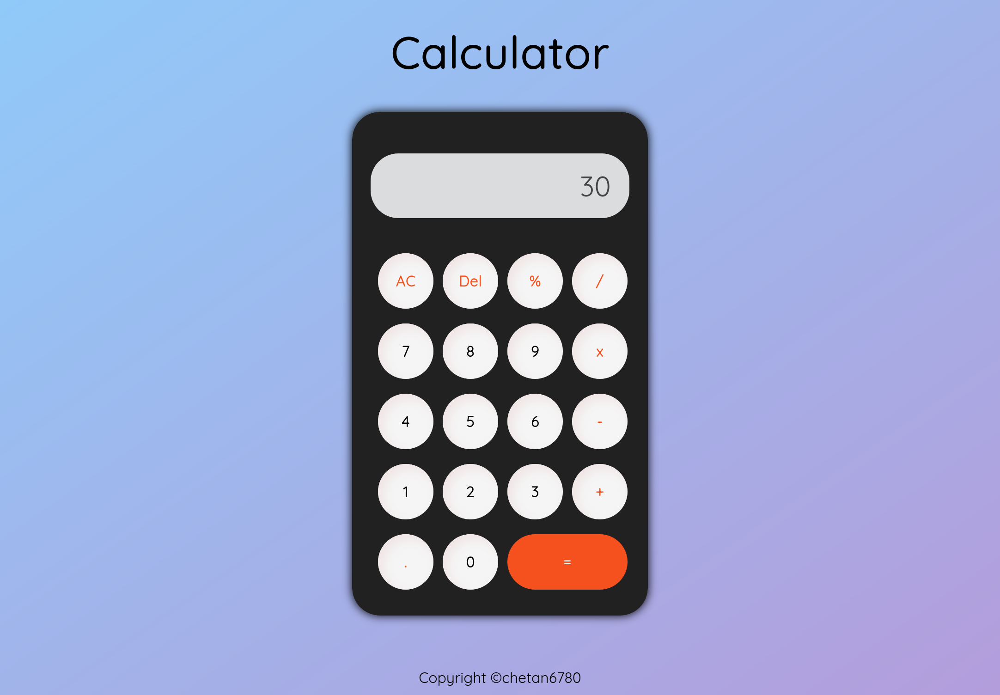
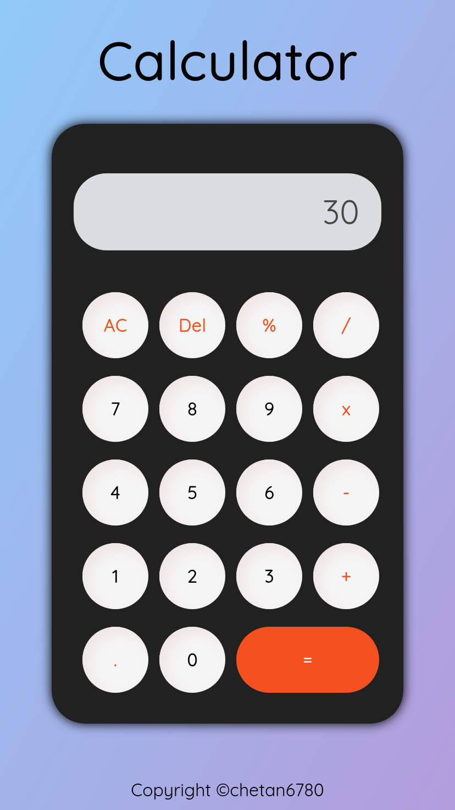

# Calculator

A Calculator build using HTML, CSS and Javascript.

#### Operations Supported:

-   Addition
-   Subtraction
-   Multiplication
-   Division
-   Percentage

### Screenshots:

    
    

<a href="https://icons8.com/icon/wLptoyIYwLb3/calculator">Calculator favicon by Icons8</a>
